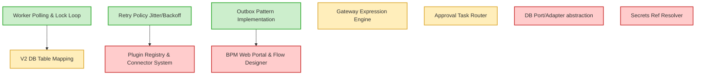

# 대상 설계와 기존 구현의 격차 분석 (Gap Analysis)

본 문서는 `bpm_pxm_workflow_platform_final_design.md` 설계 문서에 제시된 최종 아키텍처 목표 구조와 기존 PXM Engine V1 구현체 간의 격차(Gap)를 항목별로 파악하고, 각 컴포넌트의 대비 수준을 도출한 분석 보고서이다.

---

## 1. 종합 격차 요약 (Comparison Summary)

| 아키텍처 항목 | 목표 구조 (To-Be) | 기존 구현 (As-Is) | 격차 수준 (Gap Level) |
| :--- | :--- | :--- | :--- |
| **그래프 모델** | 정규화된 Definition/Nodes/Edges | 단일 `workflow_template` JSONB | **High** (정규화 및 마이그레이션 필요) |
| **실행 포인터** | explicit Token 기반 다중 병렬 처리 | 단일 `"cursor"` 문자열 포인터 | **High** (토큰 라이브러리/전이 로직 필요) |
| **DB 의존성** | Port/Adapter 기반 DBMS 독립 아키텍처 | pg/sqlx API 직접 주입 및 Raw SQL | **High** (추상 인터페이스 포팅 필요) |
| **확장 체계** | Plugin Registry + Connector 실행 | 하드코딩된 Service Node HTTP 호출 | **High** (공통 서비스 노드 디스패치 필요) |
| **보안 모델** | `secrets_ref` 간접 참조 저장 | Node Config 내 단순 저장 또는 부재 | **Medium** (Secret Resolver 모듈 필요) |
| **결재 모델** | 3종 결재라인 (고정/조건/신청자선택) | 단일 `assignee` 고정 모델 | **Medium** (태스크 생성 로직 확장 필요) |
| **UI 계층** | 역할별 업무 포털 & React Flow | 단순 API 기반 CRUD 기능 | **High** (Web 프론트엔드 전체 신규 개발) |

---

## 2. 세부 항목별 세분화 분석

### 2.1 이미 구현된 사항 (100% 재사용 가능)
- **비동기 잡 폴링 런타임**:
  - `fetch_and_mark_running`을 통한 큐 선점 메커니즘.
  - Multi-Worker 장애 격리를 위한 Lease Lock 갱신 루프 및 Heartbeat 백그라운드 태스크.
- **Outbox 기반 분산 트랜잭션**:
  - 데이터 수정과 비동기 이벤트 발행의 원자성을 보장하는 Outbox 적재 함수(`emit_outbox`).
- **운영자급 재시도 정책**:
  - Exponential Backoff + Jitter 계산 모듈 및 Retry 스케줄링.
- **기본 노드 종류별 실행기 스켈레톤**:
  - Start, End, Timer, Gateway, Approval, Service 노드의 분기 제어 구조 기본 뼈대.

### 2.2 부분 구현된 사항 (리팩토링 및 확장 필요)
- **V2 정규화 데이터베이스 스키마**:
  - V2 런타임 파운데이션 테이블 스펙(`003_v2_runtime_foundation.sql`)은 이미 마이그레이션 형태로 적용되어 있으나, 실 런타임 및 API와의 연동 로직이 0% 수준으로 완전히 빈 껍데기 상태임.
- **분기(Gateway) 조건 평가 엔진**:
  - 단순 Form 필드 값 매핑 비교 기능(`==`, `>`, `<`)만 지원하고 있어, 복합 엣지 룰 조건식을 동적으로 안전하게 해석할 논리식 평가기(Expr Parser) 도입이 절실함.
- **인적 승인 태스크**:
  - 단일 고정 승인자(`assignee`) 생성만 가능하므로, 복합 결재선 모델(조건 기반, 후보군 선정)로 태스크 할당기 규칙의 확장이 필요함.

### 2.3 완전히 부재한 사항 (신규 구현 필수)
- **Storage Port / DB Adapter 추상화**:
  - DB 드라이버 직접 호출(TypeScript: `pg.Pool`, Rust: `sqlx::PgPool`)을 제거하기 위한 Interface 정의가 전무함.
- **Plugin Registry & Connector**:
  - 플러그인 메타데이터 정보 스키마(`config_schema`), Dynamic Form 렌더링 스펙 및 커넥터 디스패처가 완전히 부재하여 신규 인프라 설계가 필수적임.
- **Multi-Token 기반의 동시성 런타임**:
  - 여러 분기가 동시에 활성화되는 Parallel Gateway를 동기화하고 처리할 explicit Token 전환 엔진 로직이 완전히 신규 구축되어야 함.
- **Secret 참조 해석기 (Secrets Ref Resolver)**:
  - 비밀 정보 보호를 위해 `secret://` URI 참조를 인앱 해석하여 실제 외부 시스템 연동 시점에 로드해주는 보안 인프라 서비스가 부재함.
- **BPM Web Portal**:
  - 사용자 역할별(설계자, 신청자, 승인자, 운영자) 개별 포털 UI 화면이 전혀 제공되지 않음.

---

## 3. 재사용, 리팩토링 및 신규 개발 매트릭스

---

## 4. 격차 극복을 위한 주요 해결과제

1. **Rust Engine의 V2 DB 구조 전환**:
   - `ctx`의 단일 문자열 cursor 방식에서 `v2_tokens` 레코드 기반의 멀티 토큰 흐름으로 엔진 런타임을 대대적으로 전환(리팩토링).
2. **NestJS API의 DB 추상화 포팅**:
   - PG Pool 직접 호출을 Port/Adapter 레이어로 한 단계 캡슐화하여 SQL Injection 위험을 근원 차단하고, 다중 DB 교체(PostgreSQL -> MongoDB 등)를 매끄럽게 준비.
3. **Plugin Connector & Executor 모듈화**:
   - 하드코딩된 HTTP 호출 메소드를 `builtin.http_request` 플러그인 구조로 리팩토링하고, 이를 기반으로 ACRA Point, NIT, Slack, Jira 등 개별 커넥터(Plugin)를 Registry 스펙에 맞춰 패키징하여 확장성을 완성.
4. **BPM 역할별 Web 개발**:
   - NestJS API를 BFF(Backend-for-Frontend)로 격상시키고, 설계자/신청자/승인자/운영자 중심의 4대 역할 뷰포트를 갖춘 프리미엄 Vite React 포털 앱 구축.
