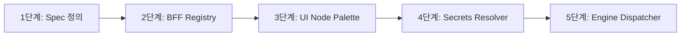

# 플러그인 커넥터 기반 전환 및 실행 상세 설계 (Plugin Conversion Plan)

본 문서는 기존 PXM Engine V1의 하드코딩된 외부 연동 구조를 종식시키고, `SERVICE Node + plugin_id` 실행 디스패치 구조를 도입하여 핵심 엔진 코어를 전혀 수정하지 않고도 외부 시스템 연동을 플러그인 형태로 추가/제거할 수 있는 플러그인 생태계 전환용 상세 설계 계획서이다.

---

## 1. `builtin.http_request` 플러그인을 활용한 기존 Service Node 흡수 방안

기존의 하드코딩된 HTTP 연동 로직은 Generic 실행기인 `builtin.http_request` 플러그인 속으로 완벽히 병합 흡수된다.

### 1.1 `builtin.http_request` 플러그인 스펙
```json
{
  "plugin_id": "builtin.http_request",
  "version": "1.0.0",
  "display_name": "범용 HTTP Request",
  "category": "Builtin",
  "node_type": "SERVICE",
  "config_schema": {
    "type": "object",
    "properties": {
      "url": { "type": "string", "title": "요청 URL" },
      "method": { "type": "string", "enum": ["GET", "POST", "PUT", "DELETE"], "title": "HTTP Method" },
      "headers": { "type": "object", "title": "HTTP Headers" },
      "body": { "type": "string", "title": "Body Template (JSON)" },
      "timeout_sec": { "type": "integer", "default": 10, "title": "타임아웃(초)" }
    },
    "required": ["url", "method"]
  },
  "executor_type": "HTTP_SPEC"
}
```

### 1.2 엔진 코어의 범용 실행 방식
1. 엔진의 `SERVICE` 노드 실행기는 더 이상 특정 URL을 품지 않는다.
2. `process_nodes`로부터 `node.config`에 명기된 `url`, `method`, `body` 정의를 취득한다.
3. 컨텍스트의 `formData`를 `body` 템플릿에 동적으로 렌더링 맵핑(`input_mapping`)한다.
4. 범용 HTTP 클라이언트로 요청을 전송하고, 응답 결과 바디 전체를 `output_mapping` 규칙에 맞춰 컨텍스트의 지정 키값에 분리 안전 적재한 뒤 다음 노드로 전이한다.

---

## 2. ACRA Point, NIT, HR, AD, Slack, Jira 연동 플러그인 전환 상세 계획

비즈니스 연동을 위한 전용 커넥터들은 엔진 코어 소스코드 수정이 일절 유발되지 않도록 **Connector Plugin 스펙 명세 등록** 및 **BFF 측 위임 Executor** 구축 체계로 통일하여 전환한다.

### 2.1 플러그인 아키텍처 흐름 예시
```text
  [ Canvas Node ] ──► (plugin_id = "connector.acra.grant_permission")
                           │
                           ▼ (Engine Core SERVICE Dispatcher)
  [ Plugin Executor Registry ] ──► [ ACRA Executor Module ]
                                          │
                                          ├─ 1. secrets_policy에 의거한 API Key 보안 조회
                                          ├─ 2. input_mapping 변환 실행
                                          └─ 3. ACRA REST API 비동기 네트워크 호출 (reqwest)
```

### 2.2 핵심 연동별 전환 스키마 설계

#### 2.2.1 ACRA Point 권한 부여 (`connector.acra.grant_permission`)
- **Config Schema**:
  ```json
  {
    "properties": {
      "targetSystem": { "type": "string", "title": "권한 대상 시스템 식별자" },
      "permissionCode": { "type": "string", "title": "부여할 권한 코드" }
    },
    "required": ["targetSystem", "permissionCode"]
  }
  ```
- **Secrets Policy (보안 정책)**:
  - `acra_api_token` 참조값을 `secret://acra/api_token`에서 로드한다.
- **동작**: 승인된 유저와 대상 시스템 및 권한 코드를 조합하여 ACRA API 서버에 권한 생성을 위임 요청한다.

#### 2.2.2 NIT 이슈 티켓 발행 (`connector.nit.create_issue`)
- **Config Schema**:
  ```json
  {
    "properties": {
      "projectKey": { "type": "string", "title": "NIT 프로젝트 코드" },
      "titleTemplate": { "type": "string", "title": "이슈 제목 템플릿" }
    },
    "required": ["projectKey", "titleTemplate"]
  }
  ```
- **동작**: 인스턴스 실패, 승인 기각 등의 상황에 대처하기 위한 NIT 내비게이션 추적 티켓을 발급한다.

#### 2.2.3 Slack 통지 알림 (`connector.slack.send_message`)
- **Config Schema**:
  ```json
  {
    "properties": {
      "channel": { "type": "string", "title": "슬랙 채널명" },
      "message": { "type": "string", "title": "마크다운 메시지 본문" }
    },
    "required": ["channel", "message"]
  }
  ```
- **동작**: 승인 도달 알림이나 실패 긴급 공지를 지정 슬랙 웹훅/봇 토큰을 통해 전송한다.

---

## 3. 핵심 엔진 수정이 필요 없는 `SERVICE + plugin_id` 구조 전환 단계

우리는 아래의 5단계 정밀 전환 시퀀스를 준수하여 기존 워크플로우 엔진의 외부 연동 체계를 완성한다.



- **1단계: 플러그인 메타데이터 명세(JSON) 정의**:
  - 각 연동 기술별로 지원 버전, 설정 스키마(`config_schema`), 보안 비밀 참조 정책(`secrets_policy`)을 담은 JSON 정의 파일을 어플리케이션 내에 적재한다.
- **2단계: BFF (NestJS API) 내 Plugin Registry API 신규 구현**:
  - Web UI Flow Designer가 사용 가능한 노드 파레트 목록을 그리도록 `/api/plugins` 및 `/api/plugins/:id` 엔드포인트를 구현하여 정밀 공급한다.
- **3단계: UI Flow Designer Dynamic Form 패널 연동**:
  - 사용자가 Flow Designer 화면에서 `ACRA Point` 노드를 캔버스에 드롭하면, 해당 노드 설정창은 하드코딩된 React 컴포넌트가 아닌 플러그인 JSON의 `config_schema`를 읽어 다이나믹 폼 렌더러가 입력 폼을 자동으로 그린다.
- **4단계: Engine Core에 Secrets Resolver 모듈 도입**:
  - 설정 필드에 박힌 `"secrets_ref": { "token": "secret://slack/bot_token" }` 정보를 가로채어, 실제 Secret Store로부터 복호화된 토큰 문자열을 런타임에 주입하는 필터 파이프라인을 구축한다.
- **5단계: Engine SERVICE Node Dispatcher 연결 및 포팅 완료**:
  - `apps/engine` 내 서비스 노드 핸들러가 `plugin_id` 기반 커넥터 디스패치 루프를 구동하도록 최종 완성한다. 
  - 신규 연동이 추가되어도 Engine Core 코드를 전혀 고치지 않고 Registry에 스펙과 비즈니스 로직(Executor)만 플러그인 형태로 끼워 넣으면 워크플로우 런타임이 무결하게 지원을 보증한다.
