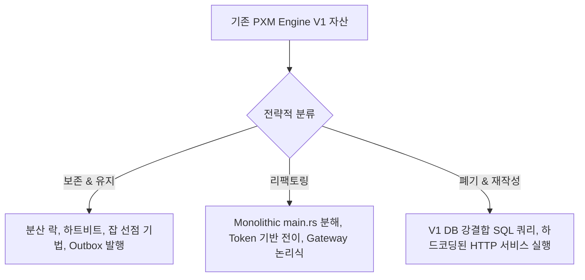

# 기존 자산 재사용 및 리팩토링 로드맵 (Reuse Plan)

본 문서는 기존 PXM Engine V1의 고부가가치 분산 처리 자산을 극대화하여 보존하면서, 목표 아키텍처에 정합하도록 리팩토링하고, 새롭게 추가될 BPM Web 및 플러그인 확장 생태계와 안정적으로 연결(Integration)하기 위한 통합 전환 로드맵 계획서이다.

---

## 1. 컴포넌트 처리 전략 분류 (Core Strategy)



### 1.1 적극 보존 및 단순 유지 (Retain)
- **Lease-based Lock & Heartbeat 메커니즘**:
  - `acquire_lease`, `renew_lease`, `release_lease`, `start_heartbeat_task`는 다중 분산 환경에서 특정 워크플로우 인스턴스가 단 하나의 워커 스레드에서만 독점 실행됨을 물리적으로 이중 보장하는 최핵심 자산이다. 그대로 유지한다.
- **Job Polling & Skip Locked**:
  - `FOR UPDATE SKIP LOCKED` 기반의 잡 선점 및 READY 잡 상태 관리 패턴은 데이터베이스 부하를 최소화하면서 완전 고성능의 큐 구조를 실현하므로 현 논리를 적극 보존한다.
- **Exponential Backoff & Jitter**:
  - `RetryPolicy` 및 백오프 연산 논리는 외부 시스템의 일시적 오류 극복을 위한 완벽한 솔루션이므로 그대로 계승한다.

### 1.2 점진적 리팩토링 (Refactor)
- **거대 파일 `main.rs` 구조화 분해**:
  - 약 1,500줄의 모놀리식 단일 Rust 파일(`main.rs`)을 V2 설계에 맞춰 `domain/`, `infrastructure/`, `ports/` 패키지로 명확히 레이어링 분리한다.
- **선형 Cursor 흐름에서 Explicit Token 구조로 포팅**:
  - `ctx`의 단일 문자열 cursor를 참조해 분기하던 방식 대신, `v2_tokens` 레코드 집합을 영속화하고 활성화된 토큰의 유무에 맞춰 전이를 수행하는 토큰 실행기로 전면 리팩토링한다.
- **Gateway의 엣지 조건 평가기 업그레이드**:
  - 기존의 String Split 기반 분기 판독을 정밀한 Expression Parser 모듈로 리팩토링하여 복합 논리 평가식을 지원한다.

### 1.3 과감한 폐기 및 전면 재작성 (Rewrite)
- **인라인 SQL 쿼리 블록 전체**:
  - NestJS와 Rust 코드에 무차별 하드코딩되어 박혀 있던 테이블 직접 참조 Raw SQL 쿼리문을 전량 소거한다. 이들은 완전히 Storage Port의 구현체(Adapter) 내부로 밀봉 격리된다.
- **하드코딩된 HTTP Node 서비스 로직 (`node_service_http`)**:
  - 특정 Flaky API 전용으로 구현되어 있던 연동 코드를 영구 삭제하고, Generic `builtin.http_request` 플러그인 로직으로 통일하여 신규 재작성한다.

---

## 2. 신규 컴포넌트 연계 계획 (BPM Web & Plugin Connectivity)

최종 워크플로우 플랫폼의 유기적 통신 흐름은 아래의 구조적 뼈대를 준수하여 연결된다.

```text
  [ BPM Web UI ] (Flow Designer / 신청 폼 / 내 결재함 / 모니터링)
        │
        ▼ (REST / SSE)
  [ Node API / BFF ] (인증, 템플릿 CRUD, Task 승인, Plugin Registry)
        │
        ├── (Port / PostgreSQL Adapter) ──► [ Core Database ] (Definition / Instances / Jobs)
        │                                         ▲
        ▼ (START / RESUME Job Inserts)            │ (Polling / Mutex Lock / Explicit Tokens)
  [ Rust Engine Worker ] ─────────────────────────┘
        │
        ▼ (plugin_id dispatch)
  [ Plugin Executor / Connector Registry ]
        ├─ builtin.http_request
        ├─ connector.slack.send_message
        └─ connector.acra.grant_permission ──► (Secrets Ref Lookup) ──► [ Secret Store ]
```

### 2.1 BPM Web 연동 포인트
- **Flow Designer & Template CRUD**:
  - 설계자가 Flow Designer에서 노드를 배치하면 Vite React 프론트엔드가 표준 JSON 포맷 정의를 조립하고, Node API가 이를 수신하여 정규화된 `v2_process_definitions`, `v2_definition_nodes`, `v2_definition_edges`에 적재한다.
- **신청 포털 & 인스턴스 기동**:
  - 일반 신청자가 신청 카탈로그에서 제출 버튼을 누르면 Node API는 `v2_process_instances` 인스턴스를 즉시 개설하고, 시작 토큰 생성 후 `v2_engine_jobs` 테이블에 `START` Job을 예약해 두는 것으로 기동 프로세스를 위임한다.
- **결재함 & Approval Task 복귀**:
  - 결재자가 결재함에서 승인 처리(`POST /tasks/:id/complete`)를 내리면, Node API는 Task를 완료(Approved/Rejected)로 갱신하고, Engine에 `RESUME` Job을 주입하여 대기 상태에 머물던 토큰을 다음 노드로 깨운다.

### 2.2 Plugin Connector 연동 포인트
- **공통 Service Node 실행 체계**:
  - Engine은 `node_type == SERVICE` 노드에 도달하면 무조건 `plugin_id` 컬럼값을 획득한다.
  - 엔진 코어는 외부 통신을 수행하지 않으며, `plugin_id` 기반 커넥터 레지스트리(Connector Registry)를 질의하여 해당하는 Executor 클래스(또는 HTTP 스펙 스키마)로 제어권을 완전히 위임(Dispatch)한다.
- **Dynamic Configuration & Secret Resolution**:
  - API BFF 단에서 노드 유형에 따른 동적 설정 스키마(`config_schema`)를 Web UI로 보내어 맞춤형 노드 패널 렌더링을 돕는다.
  - 실행 시점에는 비밀 보관소(Secret Store) 연계를 가동하여 `secrets_ref`에 묶여 있는 안전한 간접 식별자 URI(`secret://...`)를 실제 API 키값으로 투명하게 변환하여 외부 API 호출 헤더에 적재한다.
